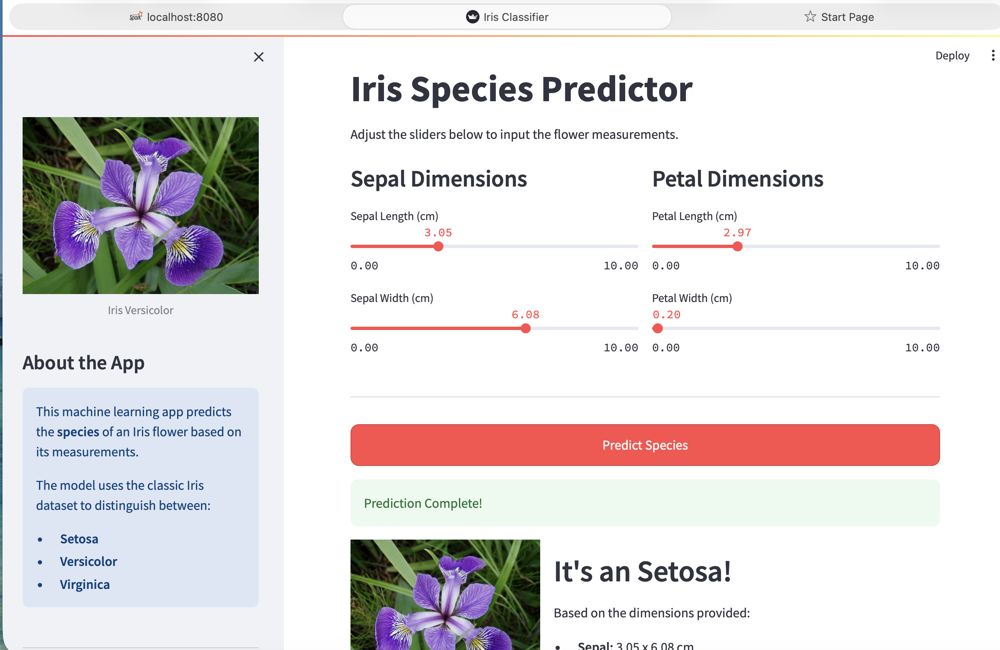
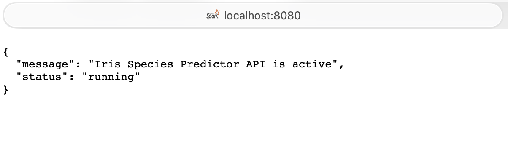

# Flask GCP MLOps Lab (Enhanced)

A comprehensive Machine Learning application for **Iris Species Prediction**, built to demonstrate **production-grade MLOps** practices on Google Cloud Platform.

## Project Overview

This project implements an end-to-end Machine Learning pipeline that allows users to classify Iris flowers based on their physical measurements (sepal and petal dimensions).

It consists of three main components:
1.  **ML Core**: A Random Forest Classifier trained on the standard Iris dataset.
2.  **Backend API**: A robust **Flask** REST API that serves the model for real-time inference.
3.  **Frontend UI**: An interactive **Streamlit** dashboard that lets users consume the API easily.

## Key Features

### Functionality
- **Real-time Inference**: Send measurements to the `/predict` endpoint and get immediate species classifications.
- **Interactive Dashboard**: Friendly UI with sliders to visualize how inputs affect the model's predictions.
- **Model Metadata**: The system serves not just predictions but context, responding with human-readable class names (Setosa, Versicolor, Virginica).

### 📸 Interface Preview
| Streamlit Dashboard | API Response |
|:-------------------:|:------------:|
|  |  |

### MLOps & Architecture
- **Robust Validation**: Uses `pydantic` to strictly validate API inputs, protecting the model from bad data.
- **Structured Logging**: Implements `structlog` to output JSON-formatted logs, essential for cloud observability (Stackdriver/Cloud Logging).
- **Automated Testing**: Features a comprehensive `pytest` suite for unit logic and integration testing, ensuring reliability.
- **CI/CD Pipeline**: A GitHub Actions workflow (`ci.yml`) automatically builds and tests code on every push, preventing regression.
- **Dockerized**: specific `Dockerfile` included for containerizing the app for Cloud Run deployment.

## Quick Start

### Prerequisites
- Python 3.9+
- `virtualenv` (recommended)

### Installation
1.  **Clone the repository**
2.  **Setup Environment**:
    ```bash
    make venv
    make install
    ```

### Training the Model
To ensure you have the latest model artifact (`model/model.pkl`) containing the trained classifier and metadata:
```bash
make train
```

### Running the Application
Start the Flask backend (API):
```bash
make run
```
*The API will start at `http://localhost:8080`*

To run the Streamlit Frontend (in a separate terminal):
```bash
streamlit run streamlit_app.py
```

## GCP Deployment

The application is dockerized and ready for Google Cloud Run.

### 1. Authenticate with GCP
```bash
# 1. Login to Google Cloud
gcloud auth login

# 2. Set your Project ID
export PROJECT_ID=your-google-cloud-project-id
gcloud config set project $PROJECT_ID
```

### 2. Enable Services (First time only)
```bash
gcloud services enable cloudbuild.googleapis.com run.googleapis.com
```

### 3. Build & Deploy
We use Cloud Build to build the image and Cloud Run to serve it.

```bash
# Submit build to Container Registry
gcloud builds submit --tag gcr.io/$PROJECT_ID/iris-app

# Deploy to Cloud Run
gcloud run deploy iris-app \
    --image gcr.io/$PROJECT_ID/iris-app \
    --platform managed \
    --region us-central1 \
    --allow-unauthenticated
```
*Note: The `--allow-unauthenticated` flag makes the API public.*

## detailed Usage
**Test via CURL**:
```bash
curl -X POST http://localhost:8080/predict \
     -H "Content-Type: application/json" \
     -d '{"sepal_length": 5.1, "sepal_width": 3.5, "petal_length": 1.4, "petal_width": 0.2}'
```

**Expected Response**:
```json
{
  "prediction": "setosa"
}
```

## Project Structure
```text
.
├── .github/workflows/   # CI/CD Automation
├── model/               # Trained Model & Metadata bundle
├── src/
│   ├── main.py          # Flask API Entrypoint with Validation
│   ├── train.py         # Training pipeline (RF Classifier)
│   └── predict.py       # Inference Logic (Model Service)
├── tests/               # Pytest Suite (Unit & Integration)
├── Makefile             # Automation Scripts
└── streamlit_app.py     # Frontend User Interface
```
